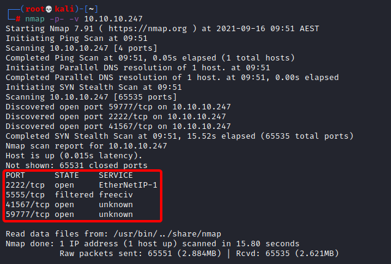
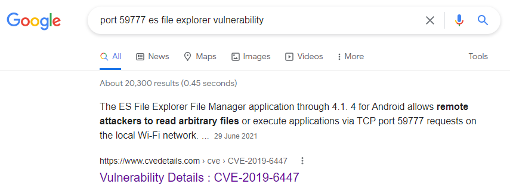
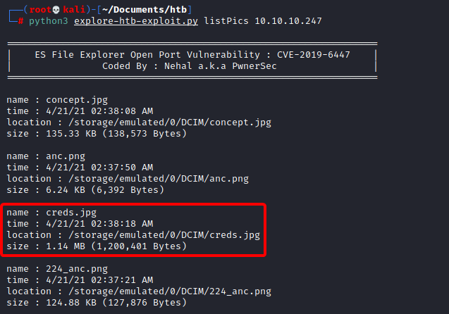
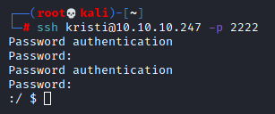
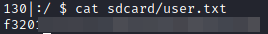
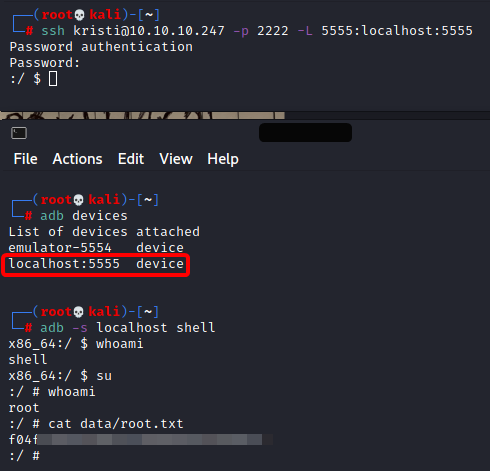

# Hack The Box - Explore
This is the second box I've system-owned on HTB. [Explore](https://hackthebox.eu/home/machines/profile/356) was a fun machine to play with which taught me a lot about the importance of perserverance. I completed this box alongside a few other work collegaues.

## Details
* OS: Android
* Difficulty: 3.6/10
* Release: 17/08/2021
* IP: 10.10.10.247
* Box Author: [bertolis](https://www.hackthebox.eu/home/users/profile/27897)

## Knowledge/Skill Requirements
* SSH Port Forwarding
* Android OS + associated tools (ADB, ES File Explorer)
* I used my Kali Linux VM to complete this.

## Enumeration
As always, I started off by looking at which services were running by executing an `nmap` scan.

Seeing that the four ports running were (`2222, 5555, 41567, 59777`) I decided to do some research on common uses of those ports on android operating systems. Information I found included:

* **2222**: SimpleSSH
* **5555**: Android Debug Bridge (ADB)
* **59777**: ES File Explorer

I never worked out what **41567** was doing.

## Analysis

The two services I wanted to look at in more detail were ADB and ES File Explorer. I'd never played with Android devices before, so I looked a little more into what each of the services did. I also searched if there were any known vulnerabilities/CVE's associated with them. And ... ✨***VOILA***✨

ES File explorer had a CVE associated with it ([CVE-2019-6447](https://www.cvedetails.com/cve/CVE-2019-6447)). The exploit allows remote users to read arbitraty files from anywhere on the network over port **59777**.

Digging around more, I found an [exploit script](https://www.exploit-db.com/exploits/50070) on exploit-db. I played around with the script and saw it can list and retrieve files from the system. Eventually I found a file called `creds.jpg` which looked promising.

I could retrieve the file by running:  
`python3 exploit-script.py getFile 10.10.10.247 /storage/emulated/0/DCIM/creds.jpg
`

The file contained what looked like a username and password (*GASP!*).

`kristi:Kr1sT!5h@Rp3xPl0r3!`

As a HTB noob, I thought I'd found the userflag here.

But when entering the password didn't work I looked at how else I could use these credentials.

## Privilege Escalation
Remembering that an SSH port was open on 2222, I tried using these creds to SSH onto the machine. And after many failed attemptes at guessing whether the password contains O's or 0's, and l's, 1's or I's, I could access the device!

Once I'd fought with `find` and `grep` (both of which I can never seem to get to work properly) I could see the flag inside `sdcard/user.txt`

## Full Control
At this point I had access to the device through ssh, and I knew I had an ADB service running on port 5555. In order to run ADB on the device, I had to set up ssh port forwarding so that I could run ADB commands on the device.

`ssh kristi@10.10.10.247 -p 2222 -L 5555:localhost:5555`

Once port forwarding was set up, I was able to run adb commands on the device, gain a shell, escalate that shell to root and search for the root.txt file.

And that's all ! Thanks for reading.
